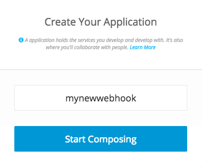
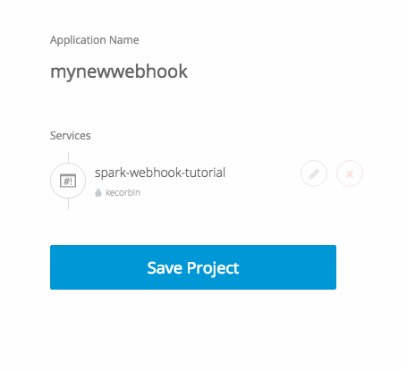
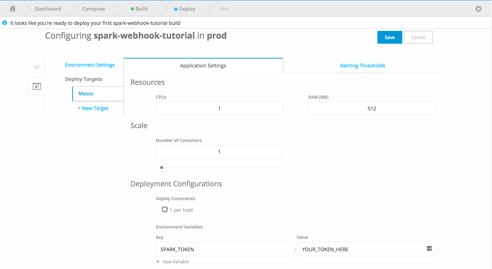
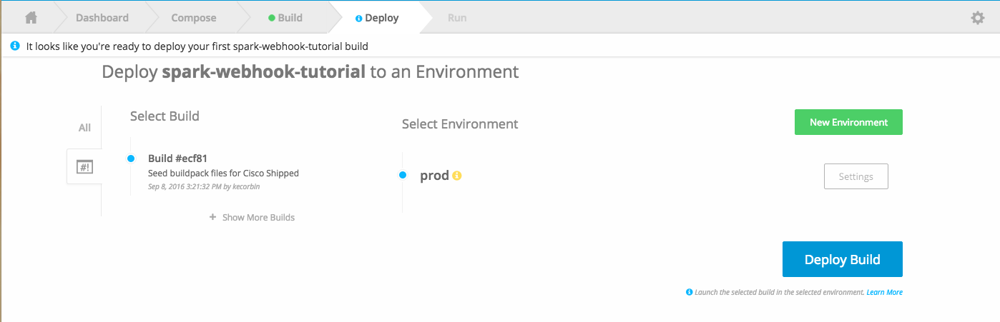

# Spark Webhook Tutorial

In this exercise we will be building an API that will receive a webhook from spark, process the incoming
request and respond back if a condition is met.

Our webhook code will be deployed on [ciscoshipped.io](https://ciscoshipped.io)

We will be practicing the following skills:

* Basic Python
* JSON Parsing
* Creating a REST API with Flask-RESTful
* Creating GET and POST requests
* Working with the Cisco Spark API
* Working with the IMAPEX supported spark-python library


## Flask Restful

For this exercise we will be using the Flask-Restful module.

Flask-RESTful is an extension for Flask that adds support for quickly building REST APIs.
Flask-RESTful encourages best practices with minimal setup.
If you are familiar with Flask, Flask-RESTful should be easy to pick up.

Full documentation for the Flask-RESTful extension can be found [here](http://flask-restful-cn.readthedocs.io/en/0.3.5/)


## Cisco Shipped

Cisco Shipped is a curated CI/CD pipeline that supports deployment targets on multiple public or private clouds.  If you haven't
already, sign up at [https://ciscoshipped.io](https://ciscoshipped.io) you will use your github credentials to signup.

Cisco Devnet has many tutorials on using Shipped - you should also check them out [here](https://developer.cisco.com/site/shipped/)


## Lab Instructions

1. Fork this repo to your Github account

2. Clone the repo to your development machine

    git clone https://github.com/YOUR_GITHUB_ID/spark-webhook-tutorial.git

3. Login to [ciscoshipped.io](https://ciscoshipped.io) with your Github credentials

4. From the "Your Applications" drop down box, select "Create New Application"

5. Give your webhook application a name, and Click the "Start Composing" button



6. From the Compose your application page, we will be adding your fork of project to your application.  Select
"Add an existing Repository" and find the spark-webhook-tutorial repository your foked in step 1.


Once your repository is listed as a service, click the "Save Project" button. You can verify that shipped made a commit to your
repository on your behalf, which will staged the required files for building the project.

7. Create an Environment to deploy your build to.  An environment is a set of configurations for a deployment.
From the deploy tab of shipped, select "Create a new environment".  Give your environment a name and a description

8. We also need a way to pass information to the webhook at runtime, such as our Spark token, for this exercise
we will use an enviornment variable to do so.  Click on the **Settings** button next to your newly created enviornent



9. After you save your environment information, click the Deploy button



8. Now it's time to start developing your webhook.  When a webhook is triggered, it will send a post request to the URL specified
in the targetUrl property.  The payload will contain JSON that looks like the following

```
{
  "filter": "roomId=Y2lzY29zcGFabcdeL3VzL1JPT00vNzYyZmMzOTAtNzA1ZC0xMWU2LTllZDItZDVmNDNhNDI2ZmFi",
  "actorId": "Y2lzY29zcGFabcdeL3VzL1BFT1BMRS82Njk3ZDE1ZC1hYTA0LTQ3ZmMtYWU5Mi1hZWQ0NWRlYjc5N2U",
  "resource": "messages",
  "name": "webhook",
  "created": "2016-09-01T16:05:15.158Z",
  "targetUrl": "http://mywebhook.mycloudservice.com/api/spark",
  "data": {
    "roomType": "group",
    "created": "2016-09-01T17:57:26.111Z",
    "personId": "Y2lzY29zcGFyazovL3VzL1BFT1BMRS82Njk3ZDE1ZC1hYTA0LTQ3ZmMtYWU5Mi1hZWQ0NWRlYjc5N2U",
    "personEmail": "someone@cisco.com",
    "roomId": "Y2lzY29zcGFabcdeL3VzL1JPT00vNzYyZmMzOTAtNzA1ZC0xMWU2LTllZDItZDVmNDNhNDI2ZmFi",
    "id": "Y2lzY29zcGFabcdeL3VzL01FU1NBR0UvOGFhM2I2ZjAtNzA2ZC0xMWU2LTk3YTMtM2IwZmE1NDcxNTEx"
  },
  "id": "Y2lzY29zcGFyadafsdfL3VzL1dFQkhPT0svNWIxNTU2MTMtNTJiMS00M2YxLWIxNjUtOGM0OTgzMjZhZTcx",
  "event": "created"
}

```

9. Complete the post method for your your instance of Resource. Review the commented code in [app.py](./app.py)

```
    # Receive a post request
    def post(self):

        # Extract the data key from the POST request

        # Determine the message ID that triggered the webhook

        # Retrieve the message based on ID
        # https://github.com/imapex/spark-python/blob/master/spark/messages.py

        # Conditional to test if we need to respond (if it's in our response_map)

        # Determine Room the message was received in

        # Send Message to room

        # Send status code to the caller

        return {'status': 'processed'}

```

**HINT:** you may want to review the source code of the spark-python library.
- https://github.com/imapex/spark-python/blob/master/spark/rooms.py
- https://github.com/imapex/spark-python/blob/master/spark/messages.py


10. You can use POSTMAN and the sample webhook data provided to test your application.


11.  Once you have your code for processing the incoming webhook message in place, you can commit your code,
and check the Shipped console for your build status and deploy the new build.

12. Once the code is successfully deployed, register your webhook by making a POST request to http://yourcustomshippedurl.com/api/spark/register


